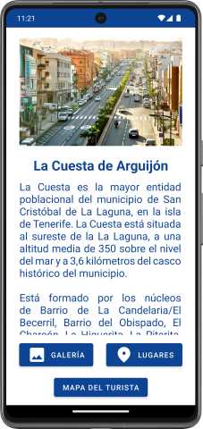
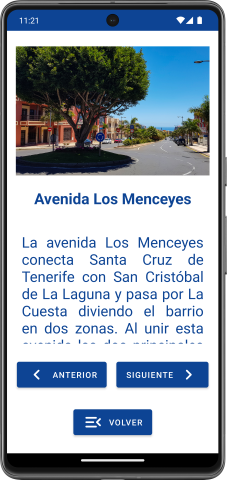
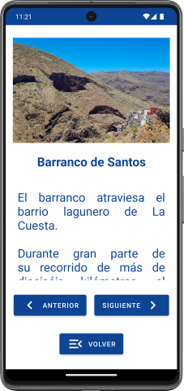
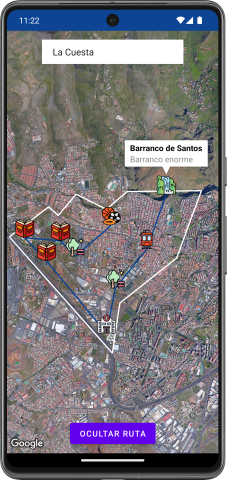
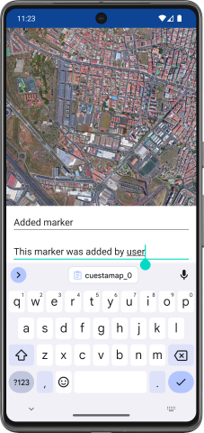
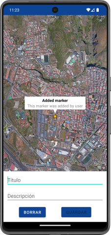

# Cuestamap
Cuestamap is an Android map app that shows the place where I grew up. It has markers at important places on the map and the possibility to add new markers.

It was built in Kotlin using Android Studio and Google Maps API.

> [!NOTE]  
> This app was made when I was a student and had a tight deadline, so don't expect quality code. 

# Images

